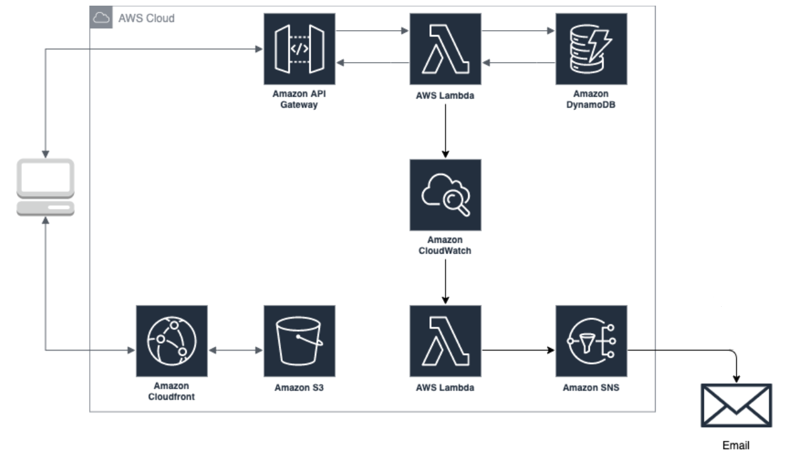

# Architecture

# Description
This Terraform code for AWS provider deploys the React app hosting it in S3 bucket and distributing with Cloudfront. Backend is based on Lambda functions for each request that are triggered by API Gateway. Data is stored in DynamoDB. Monitoring is set up with CloudWatch which triggers error Lambda function that with help of SNS sends alert on subscribed to topic emails. Billing alarm is also there.

*Note: frontend React code and Lamda fucntions are not written by me*

# Prerequisites
Locally install:
- nodejs
- npm
- aws cli

# How to use?
1. Create an S3 bucket with versioning enabled for terraform remote state. Place the name of bucket in `terraform.tf`
2. `aws configure` in terminal (provide there your access key id, secret access key and region)
3. *Optionally:* put different S3 bucket name in `./modules/s3/s3.tf`
4. `terraform init`
5. `terraform apply`

# If you face any ERRORS
You can face `function upload` or `each.value` errors. Just run terraform apply one more time and everything will be good.